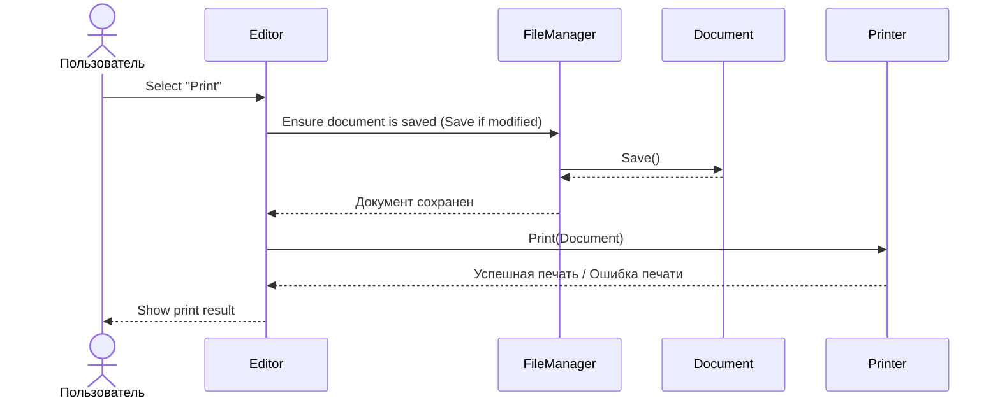
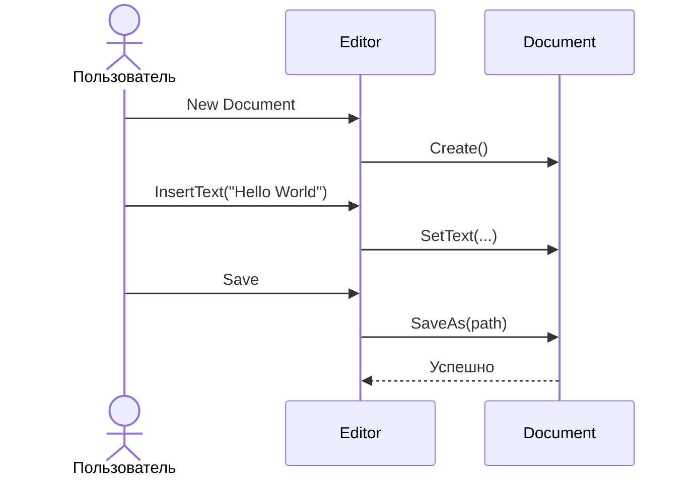

# Диаграммы последовательности текстового редактора

## 1. Процесс печати документа

```mermaid
sequenceDiagram
    actor Пользователь
    participant Editor
    participant FileManager
    participant Document
    participant Printer

    Пользователь->>Editor: Select "Print"
    Editor->>FileManager: Ensure document is saved (Save if modified)
    FileManager->>Document: Save()
    Document-->>FileManager: 
    FileManager-->>Editor: Документ сохранен
    Editor->>Printer: Print(Document)
    Printer-->>Editor: Успешная печать / Ошибка печати
    Editor-->>Пользователь: Show print result
```

## 2. Создание и сохранение документа

```mermaid
sequenceDiagram
    actor Пользователь
    participant Editor
    participant Document

    Пользователь->>Editor: New Document
    Editor->>Document: Create()
    
    Пользователь->>Editor: InsertText("Hello World")
    Editor->>Document: SetText(...)
    
    Пользователь->>Editor: Save
    Editor->>Document: SaveAs(path)
    Document-->>Editor: Успешно
```