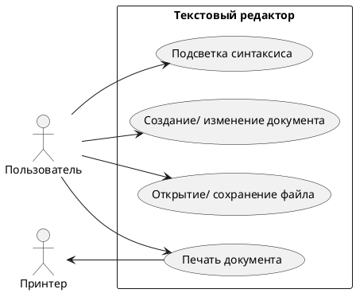

# Диаграмма прецедентов UML для текстового редактора

## Элементы системы
- **Пользователь**: Основной актер системы
- **Принтер**: Внешнее устройство для печати
- **Текстовый редактор**: Основная система с функциями:
  - Создание и редактирование документов
  - Работа с файлами
  - Печать документов
  - Подсветка синтаксиса