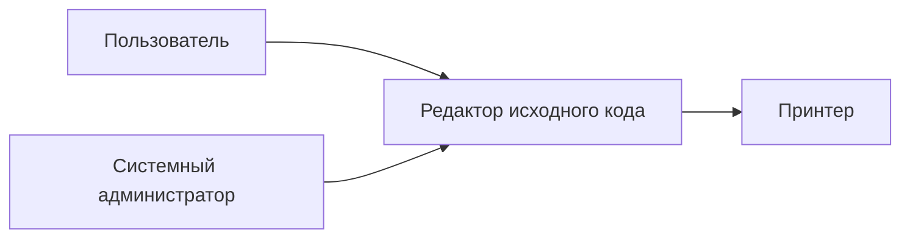

# Vision

# Введение

## Даты внесения изменений

| Версия                     | Дата              | Описание                                                                | Автор         |
| -------------------------- | ----------------- | ----------------------------------------------------------------------- | ------------- |
| Черновой начальный вариант | 14 сентября, 2025 | Первый вариант документа «Видение» для проекта редактора исходного кода |   6 группа    |

---

## Введение

Нам видится надёжное и удобное приложение для редактирования исходного кода, обеспечивающее функции создания, редактирования, сохранения и печати документов, а также интеллектуальную подсветку синтаксиса. Приложение будет позиционироваться как лёгкая альтернатива тяжёлым IDE, но с поддержкой ключевых функций для комфортной разработки.

---

## Позиционирование

### Экономические предпосылки

Существующие редакторы исходного кода либо слишком просты и не поддерживают интеллектуальные функции (подсветка, работа с файлами разных языков), либо слишком тяжёлые и требовательные к ресурсам (полноценные IDE). Возникает потребность в приложении, которое сочетает простоту и базовую функциональность с интеллектуальными возможностями, при этом оставаясь лёгким и быстрым.

### Формулировка проблемы

Традиционные текстовые редакторы не поддерживают контекстные функции для работы с кодом, а IDE избыточны для студентов и начинающих программистов. Это ведёт к проблемам:

* трудности с изучением синтаксиса;
* невозможность быстро создавать и сохранять кодовые примеры;
* отсутствие лёгкой кроссплатформенной среды.

### Место системы

Система предназначена для студентов, преподавателей, начинающих программистов и всех пользователей, которым нужен лёгкий и быстрый инструмент для написания и изучения кода. В отличие от «тяжёлых» IDE, приложение будет обладать минималистичным интерфейсом, но поддержкой подсветки синтаксиса и базовых операций с документами.

---

## Заинтересованные лица

* **Студенты и учащиеся** — хотят простой инструмент для написания и изучения программ.
* **Преподаватели** — используют систему для демонстрации примеров кода.
* **Начинающие разработчики** — применяют для первых проектов.
* **Администраторы систем** — заинтересованы в лёгкой установке и настройке.

### Основные задачи высокого уровня

| Цель высокого уровня                              | Приоритет | Проблемы и замечания                                      | Текущие решения                                       |
| ------------------------------------------------- | --------- | --------------------------------------------------------- | ----------------------------------------------------- |
| Удобное создание и сохранение программных файлов  | Высокий   | Новички теряют изменения, забывая сохранять.              | Простейшие текстовые редакторы (например, Notepad)    |
| Подсветка синтаксиса и улучшенная читаемость кода | Высокий   | Без подсветки сложно воспринимать код, особенно новичкам. | IDE (Visual Studio, IntelliJ), но они слишком сложные |
| Возможность печати и экспорта кода                | Средний   | В простых редакторах нет печати с форматированием.        | IDE решают частично                                   |
| Минималистичный интерфейс                         | Высокий   | Сложные IDE перегружены функциями.                        | Sublime/Notepad++, но требуют настройки               |

---

## Задачи уровня пользователя

* **Пользователь**:
  * Создаёт новый документ.
  * Редактирует текст.
  * Сохраняет файл.
  * Открывает существующие документы.
  * Печатает код.
  * Работает с подсветкой синтаксиса для различных языков.

* **Системный администратор**:
  * Устанавливает и настраивает систему.
  * Обеспечивает обновления и поддержку.

---

## Окружение

Система будет работать на ПК и ноутбуках под Windows, Linux и macOS. Взаимодействие с внешними устройствами ограничивается принтерами.

---

## Обзор

### Перспективы продукта

Система редактора исходного кода будет использоваться в образовательных учреждениях, учебных лабораториях и индивидуальной разработке. Основная цель продукта — предоставить пользователям лёгкий, надёжный и кроссплатформенный инструмент для работы с исходным кодом.

Редактор будет выполнять роль базовой среды разработки для начинающих программистов и студентов, обеспечивая:

* удобное создание, редактирование и сохранение файлов;
* печать исходного кода с сохранением форматирования;
* подсветку синтаксиса для популярных языков программирования;
* минималистичный интерфейс, не перегружающий новичка;
* работу на разных операционных системах без сложной настройки.

Таким образом, продукт занимает нишу между простыми текстовыми редакторами (которые не поддерживают возможности для обучения программированию) и тяжёлыми IDE (которые перегружены функциональностью и требуют высоких ресурсов).

**Рис. Видение 1. Контекстная диаграмма редактора исходного кода**

---

## Преимущества системы

| Свойство                                                                      | Преимущества заинтересованных лиц            |
| ----------------------------------------------------------------------------- | -------------------------------------------- |
| Поддержка базовых функций (создание, сохранение, открытие, печать документов) | Удобное и быстрое использование редактора    |
| Подсветка синтаксиса для популярных языков                                    | Повышение читаемости кода, помощь в обучении |
| Кроссплатформенность (Windows, Linux, macOS)                                  | Универсальность и гибкость                   |
| Минималистичный интерфейс                                                     | Простота для новичков и студентов            |
| Лёгкая установка и настройка                                                  | Подходит для учебных классов и домашних ПК   |

---

## Основные свойства системы

* Создание и редактирование документов.
* Сохранение и открытие файлов.
* Печать документов.
* Подсветка синтаксиса (C++, C#, HTML, др.).
* Кроссплатформенность.
* Минималистичный интерфейс.

---

## Другие требования и ограничения

* **Удобство использования** — интерфейс интуитивный, минимум настроек.
* **Надёжность** — сохранение изменений при сбое.
* **Производительность** — работа даже на слабых ПК.
* **Ограничения** — редактор не предназначен для крупных проектов (без сборки, отладки и плагинов).

---
