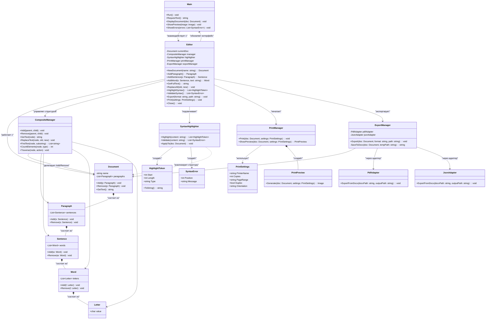

# Диаграмма классов

```mermaid

classDiagram

%% =====================================================
%% УРОВЕНЬ 0: ИНТЕРФЕЙС / MAIN
%% =====================================================
class Main {
    +Run() void
    +RequestText() string
    +DisplayDocument(doc: Document) void
    +ShowPreview(image: Image) void
    +ShowErrors(errors: List~SyntaxError~) void
}
Main --> Editor : "взаимодействует с"
Editor --> Main : "обновляет интерфейс"

%% =====================================================
%% УРОВЕНЬ 1: КОМПОНОВКА ДОКУМЕНТА (COMPOSITE)
%% =====================================================
class Document {
    -string name
    -List~Paragraph~ paragraphs
    +Add(p: Paragraph) void
    +Remove(p: Paragraph) void
    +GetText() string
}
class Paragraph {
    -List~Sentence~ sentences
    +Add(s: Sentence) void
    +Remove(s: Sentence) void
}
class Sentence {
    -List~Word~ words
    +Add(w: Word) void
    +Remove(w: Word) void
}
class Word {
    -List~Letter~ letters
    +Add(l: Letter) void
    +Remove(l: Letter) void
}
class Letter {
    +char value
}

Document *-- Paragraph : "состоит из"
Paragraph *-- Sentence : "состоит из"
Sentence *-- Word : "состоит из"
Word *-- Letter : "состоит из"

%% =====================================================
%% УРОВЕНЬ 2: УПРАВЛЕНИЕ КОМПОЗИЦИЕЙ (CompositeManager)
%% =====================================================
class CompositeManager {
    +Add(parent, child) void
    +Remove(parent, child) void
    +GetText(node) string
    +ReplaceText(node, old, new) void
    +FindText(node, substring): List~string~
    +CountElements(node, type): int
    +Traverse(node, action) void
}

CompositeManager --> Document : "делегирует Add/Remove"
CompositeManager --> Paragraph
CompositeManager --> Sentence
CompositeManager --> Word
CompositeManager --> Letter

%% =====================================================
%% УРОВЕНЬ 3: СИНТАКСИС
%% =====================================================
class SyntaxHighlighter {
    +Highlight(content: string): List~HighlightToken~
    +Validate(content: string): List~SyntaxError~
    +ApplyTo(doc: Document): void
}
class HighlightToken {
    +int Start
    +int Length
    +string Type
    +ToString(): string
}
class SyntaxError {
    +int Position
    +string Message
}
SyntaxHighlighter --> HighlightToken : "создаёт"
SyntaxHighlighter --> SyntaxError : "создаёт"
SyntaxHighlighter ..> Document : "анализирует структуру"

%% =====================================================
%% УРОВЕНЬ 4: ПЕЧАТЬ
%% =====================================================
class PrintSettings {
    +string PrinterName
    +int Copies
    +string PageRange
    +bool Duplex
    +string Orientation
}
class PrintPreview {
    +Generate(doc: Document, settings: PrintSettings): Image
}
class PrintManager {
    +Print(doc: Document, settings: PrintSettings): void
    +ShowPreview(doc: Document, settings: PrintSettings): PrintPreview
}

PrintManager --> PrintSettings : "использует"
PrintManager *-- PrintPreview : "создаёт"

%% =====================================================
%% УРОВЕНЬ 5: ЭКСПОРТ (DOCX / PDF / JSON)
%% =====================================================
class ExportManager {
    -PdfAdapter pdfAdapter
    -JsonAdapter jsonAdapter
    +Export(doc: Document, format: string, path: string): void
    -SaveToDocx(doc: Document, tempPath: string): string
}

class PdfAdapter {
    +ExportFromDocx(docxPath: string, outputPath: string): void
}
class JsonAdapter {
    +ExportFromDocx(docxPath: string, outputPath: string): void
}

ExportManager --> Document : "сохраняет DOCX"
ExportManager --> PdfAdapter : "через адаптер"
ExportManager --> JsonAdapter : "через адаптер"

%% =====================================================
%% УРОВЕНЬ 6: РЕДАКТОР
%% =====================================================
class Editor {
    -Document currentDoc
    -CompositeManager manager
    -SyntaxHighlighter highlighter
    -PrintManager printManager
    -ExportManager exportManager

    +NewDocument(name: string): Document
    +AddParagraph(): Paragraph
    +AddSentence(p: Paragraph): Sentence
    +AddWord(s: Sentence, text: string): Word
    +GetFullText(): string
    +ReplaceAll(old, new): void
    +HighlightSyntax(): List~HighlightToken~
    +ValidateSyntax(): List~SyntaxError~
    +Export(format: string, path: string): void
    +Print(settings: PrintSettings): void
    +Close(): void
}

Editor --> Document : "работает с"
Editor --> CompositeManager : "управляет структурой"
Editor --> SyntaxHighlighter : "подсвечивает"
Editor --> PrintManager : "печатает"
Editor --> ExportManager : "экспортирует"


```
