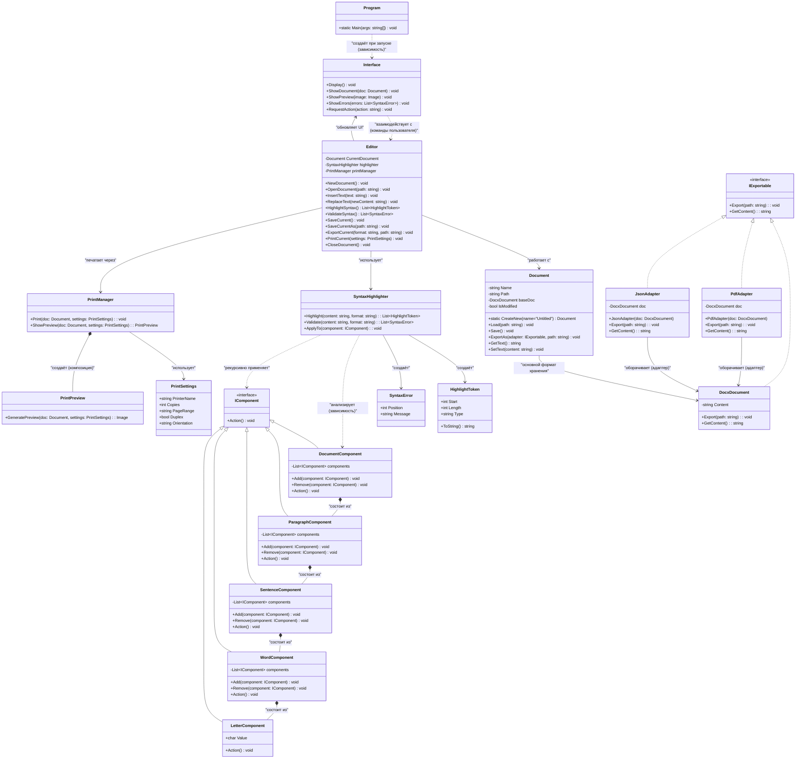

# Диаграмма классов

```mermaid

classDiagram
    %% ========================
    %% УРОВЕНЬ 0: ИНТЕРФЕЙС ПОЛЬЗОВАТЕЛЯ
    %% ========================
    class Interface {
        +Display() void
        +ShowDocument(doc: Document) void
        +ShowPreview(image: Image) void
        +ShowErrors(errors: List~SyntaxError~) void
        +RequestAction(action: string) void
    }

    Interface ..> Editor : "взаимодействует с (команды пользователя)"
    Editor --> Interface : "обновляет UI"

    %% ========================
    %% УРОВЕНЬ 1: АБСТРАКЦИИ
    %% ========================
    class IComponent {
        <<interface>>
        +Action() void
    }

    class IExportable {
        <<interface>>
        +Export(path: string): void
        +GetContent(): string
    }

    %% ========================
    %% УРОВЕНЬ 2: КОМПОНОВЩИК
    %% ========================
    class DocumentComponent {
        -List~IComponent~ components
        +Add(component: IComponent) void
        +Remove(component: IComponent) void
        +Action() void
    }

    class ParagraphComponent {
        -List~IComponent~ components
        +Add(component: IComponent) void
        +Remove(component: IComponent) void
        +Action() void
    }

    class SentenceComponent {
        -List~IComponent~ components
        +Add(component: IComponent) void
        +Remove(component: IComponent) void
        +Action() void
    }

    class WordComponent {
        -List~IComponent~ components
        +Add(component: IComponent) void
        +Remove(component: IComponent) void
        +Action() void
    }

    class LetterComponent {
        +char Value
        +Action() void
    }

    IComponent <|-- DocumentComponent
    IComponent <|-- ParagraphComponent
    IComponent <|-- SentenceComponent
    IComponent <|-- WordComponent
    IComponent <|-- LetterComponent

    DocumentComponent *-- ParagraphComponent : "состоит из"
    ParagraphComponent *-- SentenceComponent : "состоит из"
    SentenceComponent *-- WordComponent : "состоит из"
    WordComponent *-- LetterComponent : "состоит из"

    %% ========================
    %% УРОВЕНЬ 3: ДОКУМЕНТЫ И АДАПТЕРЫ
    %% ========================
    class Document {
        -string Name
        -string Path
        -DocxDocument baseDoc
        -bool IsModified
        +static CreateNew(name="Untitled") Document
        +Load(path: string) void
        +Save() void
        +ExportAs(adapter: IExportable, path: string) void
        +GetText() string
        +SetText(content: string) void
    }

    class DocxDocument {
        -string Content
        +Export(path: string): void
        +GetContent(): string
    }

    class PdfAdapter {
        -DocxDocument doc
        +PdfAdapter(doc: DocxDocument)
        +Export(path: string): void
        +GetContent(): string
    }

    class JsonAdapter {
        -DocxDocument doc
        +JsonAdapter(doc: DocxDocument)
        +Export(path: string): void
        +GetContent(): string
    }

    IExportable <|.. DocxDocument
    IExportable <|.. PdfAdapter
    IExportable <|.. JsonAdapter

    PdfAdapter --> DocxDocument : "оборачивает (адаптер)"
    JsonAdapter --> DocxDocument : "оборачивает (адаптер)"
    Document --> DocxDocument : "основной формат хранения"

    %% ========================
    %% УРОВЕНЬ 4: СИНТАКСИС
    %% ========================
    class SyntaxHighlighter {
        +Highlight(content: string, format: string): List~HighlightToken~
        +Validate(content: string, format: string): List~SyntaxError~
        +ApplyTo(component: IComponent): void
    }

    class HighlightToken {
        +int Start
        +int Length
        +string Type
        +ToString() string
    }

    class SyntaxError {
        +int Position
        +string Message
    }

    SyntaxHighlighter --> HighlightToken : "создаёт"
    SyntaxHighlighter --> SyntaxError : "создаёт"
    SyntaxHighlighter ..> DocumentComponent : "анализирует (зависимость)"
    SyntaxHighlighter ..> IComponent : "рекурсивно применяет"

    %% ========================
    %% УРОВЕНЬ 5: ПЕЧАТЬ
    %% ========================
    class PrintSettings {
        +string PrinterName
        +int Copies
        +string PageRange
        +bool Duplex
        +string Orientation
    }

    class PrintPreview {
        +GeneratePreview(doc: Document, settings: PrintSettings): Image
    }

    class PrintManager {
        +Print(doc: Document, settings: PrintSettings): void
        +ShowPreview(doc: Document, settings: PrintSettings): PrintPreview
    }

    PrintManager --> PrintSettings : "использует"
    PrintManager *-- PrintPreview : "создаёт (композиция)"

    %% ========================
    %% УРОВЕНЬ 6: РЕДАКТОР
    %% ========================
    class Editor {
        -Document CurrentDocument
        -SyntaxHighlighter highlighter
        -PrintManager printManager
        +NewDocument() void
        +OpenDocument(path: string) void
        +InsertText(text: string) void
        +ReplaceText(newContent: string) void
        +HighlightSyntax() List~HighlightToken~
        +ValidateSyntax() List~SyntaxError~
        +SaveCurrent() void
        +SaveCurrentAs(path: string) void
        +ExportCurrent(format: string, path: string) void
        +PrintCurrent(settings: PrintSettings) void
        +CloseDocument() void
    }

    Editor --> Document : "работает с"
    Editor --> SyntaxHighlighter : "использует"
    Editor --> PrintManager : "печатает через"

    %% ========================
    %% УРОВЕНЬ 7: ПРОГРАММА
    %% ========================
    class Program {
        +static Main(args: string[]) void
    }

    Program ..> Interface : "создаёт при запуске (зависимость)"


```
