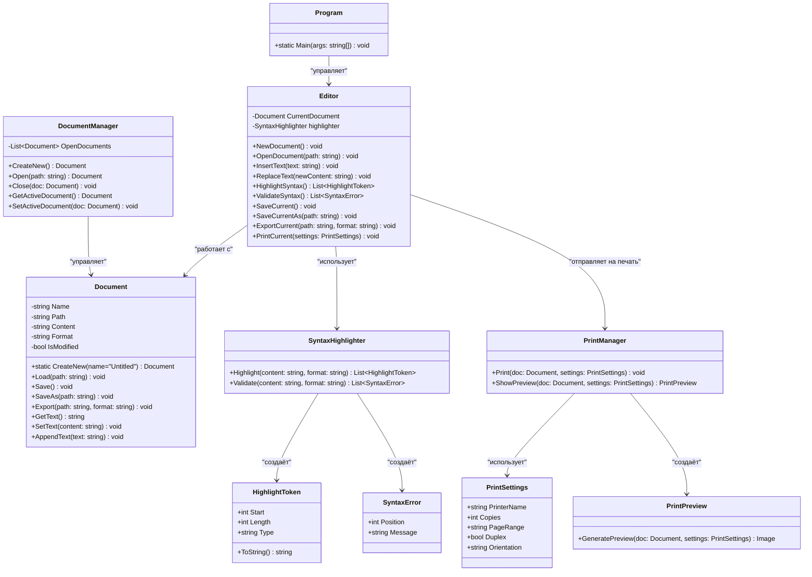

# Диаграмма классов

```mermaid

classDiagram
    %% ====== ДОКУМЕНТ ======
    class Document {
        -string Name
        -string Path
        -string Content
        -string Format
        -bool IsModified
        +static CreateNew(name="Untitled") Document
        +Load(path: string) void
        +Save() void
        +SaveAs(path: string) void
        +Export(path: string, format: string) void
        +GetText() string
        +SetText(content: string) void
        +AppendText(text: string) void
    }

    class DocumentManager {
        -List~Document~ OpenDocuments
        +CreateNew() Document
        +Open(path: string) Document
        +Close(doc: Document) void
        +GetActiveDocument() Document
        +SetActiveDocument(doc: Document) void
    }

    %% ====== РЕДАКТИРОВАНИЕ ======
    class Editor {
        -Document CurrentDocument
        -SyntaxHighlighter highlighter
        +NewDocument() void
        +OpenDocument(path: string) void
        +InsertText(text: string) void
        +ReplaceText(newContent: string) void
        +HighlightSyntax() List~HighlightToken~
        +ValidateSyntax() List~SyntaxError~
        +SaveCurrent() void
        +SaveCurrentAs(path: string) void
        +ExportCurrent(path: string, format: string) void
        +PrintCurrent(settings: PrintSettings) void
    }

    %% ====== СИНТАКСИС ======
    class HighlightToken {
        +int Start
        +int Length
        +string Type
        +ToString() string
    }

    class SyntaxError {
        +int Position
        +string Message
    }

    class SyntaxHighlighter {
        +Highlight(content: string, format: string) List~HighlightToken~
        +Validate(content: string, format: string) List~SyntaxError~
    }

    %% ====== ПЕЧАТЬ ======
    class PrintSettings {
        +string PrinterName
        +int Copies
        +string PageRange
        +bool Duplex
        +string Orientation
    }

    class PrintPreview {
        +GeneratePreview(doc: Document, settings: PrintSettings) Image
    }

    class PrintManager {
        +Print(doc: Document, settings: PrintSettings) void
        +ShowPreview(doc: Document, settings: PrintSettings) PrintPreview
    }

    %% ====== ПРОГРАММА ======
    class Program {
        +static Main(args: string[]) void
    }

    %% ====== СВЯЗИ ======
    Editor --> Document : "работает с"
    Editor --> SyntaxHighlighter : "использует"
    SyntaxHighlighter --> HighlightToken : "создаёт"
    SyntaxHighlighter --> SyntaxError : "создаёт"
    Editor --> PrintManager : "отправляет на печать"
    PrintManager --> PrintSettings : "использует"
    PrintManager --> PrintPreview : "создаёт"
    DocumentManager --> Document : "управляет"
    Program --> Editor : "управляет"

```
