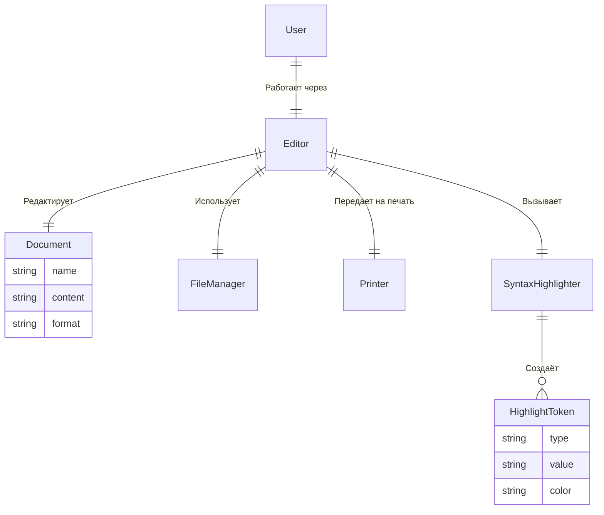

# Domain Model

```mermaid
erDiagram
    User ||--|| Editor : "Работает через"
    Editor ||--|| Document : "Редактирует"
    Editor ||--|| FileManager : "Использует"
    Editor ||--|| Printer : "Передает на печать"
    Editor ||--|| SyntaxHighlighter : "Вызывает"
    SyntaxHighlighter ||--o{ HighlightToken : "Создаёт"

    User {
    }

    Document {
        string name
        string content
        string format
    }

    Editor {
    }

    FileManager {
    }

    Printer {
    }

    SyntaxHighlighter {
    }

    HighlightToken {
        string type
        string value
        string color
    }
```
