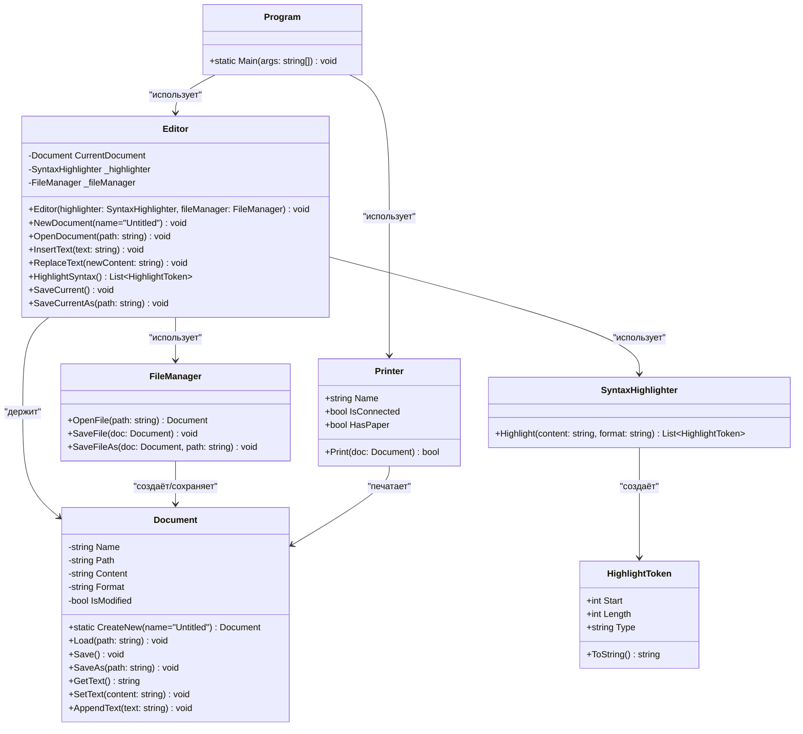

# Domain Model

```mermaid
classDiagram
    class Document {
        -string Name
        -string Path
        -string Content
        -string Format
        -bool IsModified
        +static CreateNew(name="Untitled") Document
        +Load(path: string) void
        +Save() void
        +SaveAs(path: string) void
        +GetText() string
        +SetText(content: string) void
        +AppendText(text: string) void
    }

    class FileManager {
        +OpenFile(path: string) Document
        +SaveFile(doc: Document) void
        +SaveFileAs(doc: Document, path: string) void
    }

    class HighlightToken {
        +int Start
        +int Length
        +string Type
        +ToString() string
    }

    class SyntaxHighlighter {
        +Highlight(content: string, format: string) List~HighlightToken~
    }

    class Editor {
        -Document CurrentDocument
        -SyntaxHighlighter _highlighter
        -FileManager _fileManager
        +Editor(highlighter: SyntaxHighlighter, fileManager: FileManager) void
        +NewDocument(name="Untitled") void
        +OpenDocument(path: string) void
        +InsertText(text: string) void
        +ReplaceText(newContent: string) void
        +HighlightSyntax() List~HighlightToken~
        +SaveCurrent() void
        +SaveCurrentAs(path: string) void
    }

    class Printer {
        +string Name
        +bool IsConnected
        +bool HasPaper
        +Print(doc: Document) bool
    }

    class Program {
        +static Main(args: string[]) void
    }

    Editor --> Document : "держит"
    Editor --> SyntaxHighlighter : "использует"
    Editor --> FileManager : "использует"
    SyntaxHighlighter --> HighlightToken : "создаёт"
    FileManager --> Document : "создаёт/сохраняет"
    Printer --> Document : "печатает"
    Program --> Editor : "использует"
    Program --> Printer : "использует"
```
