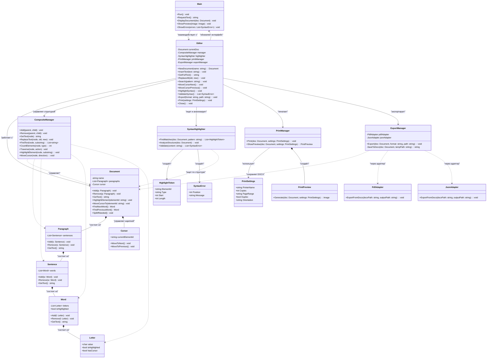

# Диаграмма классов

```mermaid
classDiagram

%% =========================
%% MAIN
%% =========================
class Main {
    +Run() void
    +RequestText() string
    +DisplayDocument(doc: Document) void
    +ShowPreview(image: Image) void
    +ShowErrors(errors: List~SyntaxError~) void
}
Main --> Editor : "взаимодействует с"
Editor --> Main : "обновляет интерфейс"


%% =========================
%% COMPOSITE STRUCTURE
%% =========================
class Document {
    -string name
    -List~Paragraph~ paragraphs
    -Cursor cursor
    +Add(p: Paragraph) void
    +Remove(p: Paragraph) void
    +GetText() string
    +HighlightElement(elementId: string) void
    +MoveCursorTo(elementId: string) void
    +FindNextWord() Word
    +FindPreviousWord() Word
    +SplitIfNeeded() void
}
class Paragraph {
    -List~Sentence~ sentences
    +Add(s: Sentence) void
    +Remove(s: Sentence) void
    +GetText() string
}
class Sentence {
    -List~Word~ words
    +Add(w: Word) void
    +Remove(w: Word) void
    +GetText() string
}
class Word {
    -List~Letter~ letters
    +bool isHighlighted
    +Add(l: Letter) void
    +Remove(l: Letter) void
    +GetText() string
}
class Letter {
    +char value
    +bool isHighlighted
    +bool hasCursor
}
class Cursor {
    +string currentElementId
    +MoveToNext() void
    +MoveToPrevious() void
}

Document *-- Paragraph : "состоит из"
Paragraph *-- Sentence : "состоит из"
Sentence *-- Word : "состоит из"
Word *-- Letter : "состоит из"
Document *-- Cursor : "управляет кареткой"


%% =========================
%% COMPOSITE MANAGER
%% =========================
class CompositeManager {
    +Add(parent, child) void
    +Remove(parent, child) void
    +GetText(node) string
    +ReplaceText(node, old, new) void
    +FindText(node, substring): List~string~
    +CountElements(node, type): int
    +Traverse(node, action) void
    +HighlightElement(node, substring): void
    +MoveCursor(node, direction): void
}

CompositeManager ..> Document : "управляет"
CompositeManager ..> Paragraph
CompositeManager ..> Sentence
CompositeManager ..> Word
CompositeManager ..> Letter


%% =========================
%% SYNTAX HIGHLIGHTER
%% =========================
class SyntaxHighlighter {
    +FindMatches(doc: Document, pattern: string): List~HighlightToken~
    +AnalyzeStructure(doc: Document): void
    +Validate(content: string): List~SyntaxError~
}
class HighlightToken {
    +string ElementId
    +string Type
    +int Start
    +int Length
}
class SyntaxError {
    +int Position
    +string Message
}

SyntaxHighlighter --> HighlightToken : "создаёт"
SyntaxHighlighter --> SyntaxError : "создаёт"
SyntaxHighlighter ..> Document : "ищет по структуре"


%% =========================
%% ПЕЧАТЬ
%% =========================
class PrintSettings {
    +string PrinterName
    +int Copies
    +string PageRange
    +bool Duplex
    +string Orientation
}
class PrintPreview {
    +Generate(doc: Document, settings: PrintSettings): Image
}
class PrintManager {
    +Print(doc: Document, settings: PrintSettings): void
    +ShowPreview(doc: Document, settings: PrintSettings): PrintPreview
}

PrintManager --> PrintSettings : "использует"
PrintManager *-- PrintPreview : "создаёт"


%% =========================
%% ЭКСПОРТ
%% =========================
class ExportManager {
    -PdfAdapter pdfAdapter
    -JsonAdapter jsonAdapter
    +Export(doc: Document, format: string, path: string): void
    -SaveToDocx(doc: Document, tempPath: string): string
}

class PdfAdapter {
    +ExportFromDocx(docxPath: string, outputPath: string): void
}
class JsonAdapter {
    +ExportFromDocx(docxPath: string, outputPath: string): void
}

ExportManager ..> Document : "сохраняет DOCX"
ExportManager ..> PdfAdapter : "через адаптер"
ExportManager ..> JsonAdapter : "через адаптер"


%% =========================
%% EDITOR
%% =========================
class Editor {
    -Document currentDoc
    -CompositeManager manager
    -SyntaxHighlighter highlighter
    -PrintManager printManager
    -ExportManager exportManager

    +NewDocument(name: string): Document
    +InsertText(text: string): void
    +GetFullText(): string
    +ReplaceAll(old, new): void
    +Search(pattern: string): void
    +MoveCursorNext(): void
    +MoveCursorPrevious(): void
    +HighlightSyntax(): void
    +ValidateSyntax(): List~SyntaxError~
    +Export(format: string, path: string): void
    +Print(settings: PrintSettings): void
    +Close(): void
}

Editor --> Document : "работает с"
Editor --> CompositeManager : "управляет структурой"
Editor --> SyntaxHighlighter : "ищет и анализирует"
Editor --> PrintManager : "печатает"
Editor --> ExportManager : "экспортирует"
```
