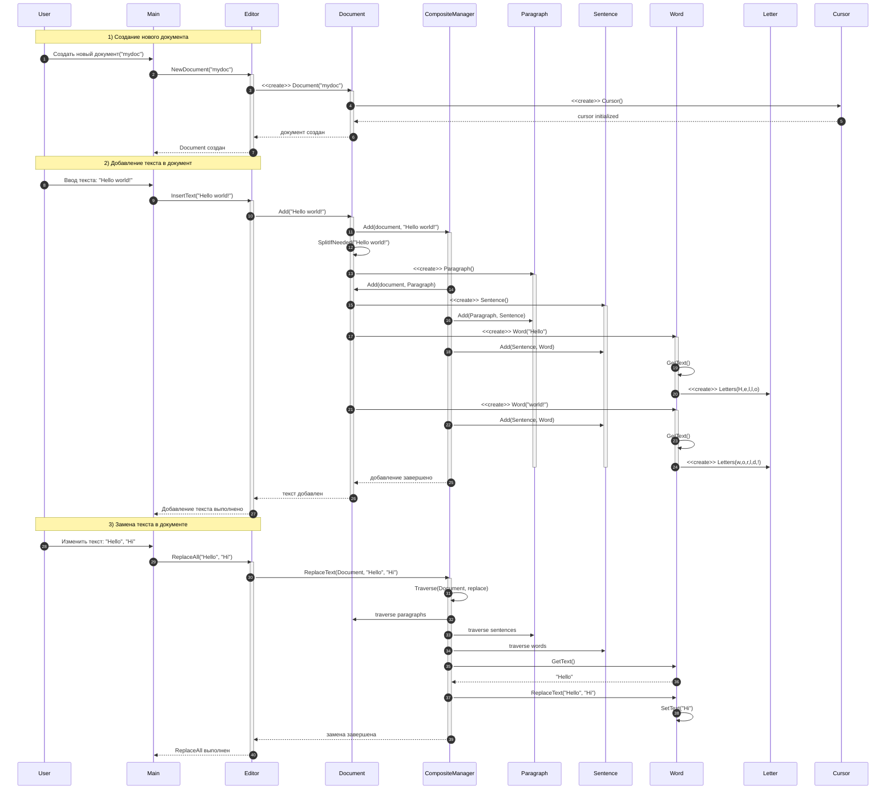

# Прецедент 1: Создание и редактирование документа

## Основная информация

**Рамки:** Приложение «Текстовый редактор» с поддержкой композитной структуры документа  
**Уровень:** Задача, определённая пользователем  
**Основной исполнитель:** Пользователь  

## Заинтересованные лица и их требования

| Лицо | Требования |
|------|------------|
| Пользователь | Хочет создавать и редактировать документы с сохранением структуры (абзацы, предложения, слова) |
| Разработчики | Требуют четкой архитектуры с паттерном Composite для управления элементами документа |

## Предусловия

- Приложение запущено
- Система готова к созданию новых документов

## Постусловия (результаты)

- Новый документ создан с иерархической структурой
- Текст разбит на структурные элементы (абзацы, предложения, слова)
- Курсор инициализирован для редактирования

## Основной успешный сценарий

1. Пользователь создает новый документ с именем
2. Система инициализирует документ с композитной структурой
3. Пользователь вводит текст
4. Система автоматически разбивает текст на структурные элементы:
   - Абзацы (Paragraph)
   - Предложения (Sentence) 
   - Слова (Word)
   - Буквы (Letter)
5. Пользователь выполняет операции замены текста
6. Система обходит структуру документа и обновляет соответствующие элементы

## Расширения (альтернативные потоки)

### 4а. Сложная структура текста
- Система автоматически определяет границы предложений и абзацев
- Создает соответствующую иерархию элементов

### 6а. Частичное совпадение при замене
- Система находит и заменяет только полные совпадения
- Сохраняет целостность структурных элементов

## Специальные требования

- Поддержка композитной структуры документа
- Автоматическое разбиение текста на логические элементы
- Рекурсивный обход структуры для операций поиска и замены
- Инициализация курсора для навигации по документу

## Частота использования

**Очень высокая:** базовые операции создания и редактирования документов

## Технические особенности

- **Паттерн Composite:** для управления иерархией элементов документа
- **Рекурсивный обход:** для операций над всей структурой документа
- **Автоматическое парсинг:** разбиение текста на структурные элементы

## Диаграмма последовательности создания и редактирования документа

## Структурные элементы документа

| Элемент | Описание | Ответственность |
|---------|----------|-----------------|
| **Document** | Основной контейнер документа | Управление всей структурой |
| **Paragraph** | Абзац текста | Содержит предложения |
| **Sentence** | Предложение | Содержит слова |
| **Word** | Слово | Содержит буквы |
| **Letter** | Буква/символ | Базовый элемент текста |
| **Cursor** | Курсор редактирования | Навигация по документу |

## Операции управления структурой

- **Автоматическое разбиение:** Текст автоматически парсится на структурные элементы
- **Рекурсивный обход:** Операции применяются ко всей иерархии документа
- **Композитное управление:** Единый интерфейс для работы с элементами разного уровня
