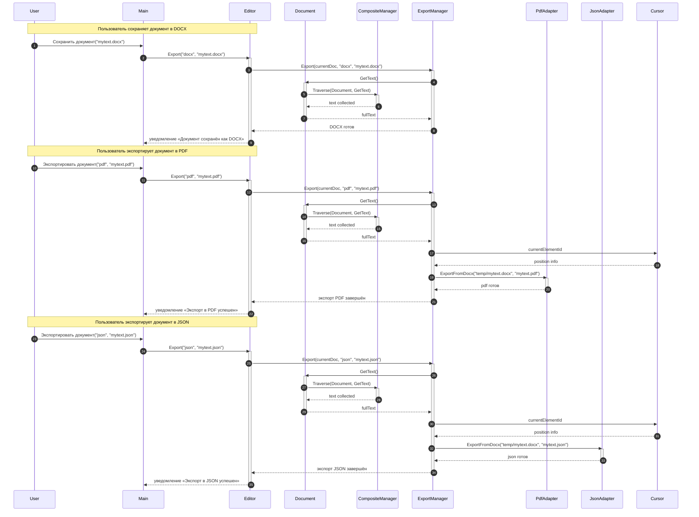

# Прецедент: Открытие и сохранение файла

## Основная информация

**Рамки:** Приложение «Текстовый редактор» с поддержкой многоплатформенного экспорта  
**Уровень:** Задача, определённая пользователем  
**Основной исполнитель:** Пользователь  

## Заинтересованные лица и их требования

| Лицо | Требования |
|------|------------|
| Пользователь | Хочет экспортировать документы в разные форматы (DOCX, PDF, JSON) для различных целей |
| Разработчики | Требуют модульной архитектуры с адаптерами для разных форматов экспорта |
| Системные интеграторы | Нуждаются в структурированных данных (JSON) для интеграции с другими системами |

## Предусловия

- Приложение запущено
- Документ создан и содержит текст
- Пользователь имеет права на запись в файловую систему

## Постусловия (результаты)

- Документ экспортирован в выбранный формат
- Сохранена структурная информация документа
- Позиция курсора учтена при экспорте (для навигации)

## Основной успешный сценарий

1. Пользователь выбирает формат экспорта (DOCX/PDF/JSON)
2. Система собирает текст документа через композитную структуру
3. CompositeManager рекурсивно обходит все элементы документа
4. ExportManager обрабатывает данные и передает соответствующему адаптеру
5. Адаптер преобразует данные в целевой формат
6. Система сохраняет файл и уведомляет пользователь об успехе

## Расширения (альтернативные потоки)

### 2а. Документ пустой
- Система создает файл с минимальной структурой
- Уведомляет пользователя о создании пустого документа

### 4а. Ошибка адаптера
- Система переключается на резервный метод экспорта
- Сообщает пользователю о проблеме с конкретным форматом

### 5а. Проблемы с файловой системой
- Система предлагает альтернативный путь для сохранения
- Сохраняет временную копию в памяти приложения

## Специальные требования

- Поддержка множественных форматов экспорта через адаптеры
- Сохранение структурной информации документа
- Учет позиции курсора для будущих сессий редактирования
- Модульная архитектура для легкого добавления новых форматов

## Частота использования

**Высокая:** экспорт документов для обмена, печати и интеграции с другими системами

## Технические особенности

- **Паттерн Adapter:** для конвертации в различные форматы
- **Рекурсивный обход:** для сбора данных из композитной структуры
- **Модульность:** легкое добавление новых форматов экспорта

## Диаграмма последовательности экспорта документа

## Поддерживаемые форматы экспорта

| Формат | Назначение | Особенности |
|--------|------------|-------------|
| **DOCX** | Основной формат редактирования | Сохраняет полную структуру документа |
| **PDF** | Для печати и распространения | Сохраняет форматирование, защита от изменений |
| **JSON** | Для интеграции и анализа | Структурированные данные, метаинформация, позиция курсора |

## Компоненты системы экспорта

| Компонент | Ответственность |
|-----------|-----------------|
| **ExportManager** | Координация процесса экспорта, выбор адаптера |
| **CompositeManager** | Рекурсивный обход структуры документа для сбора данных |
| **PdfAdapter** | Преобразование документа в PDF формат |
| **JsonAdapter** | Сериализация документа и метаданных в JSON |
| **Cursor** | Предоставление информации о текущей позиции редактирования |

## Метаданные сохраняемые при экспорте

- **Текст документа:** полное содержимое с структурой
- **Позиция курсора:** для восстановления сессии редактирования
- **Структурная информация:** иерархия абзацев, предложений, слов
- **Временные метки:** информация о времени создания и изменения
