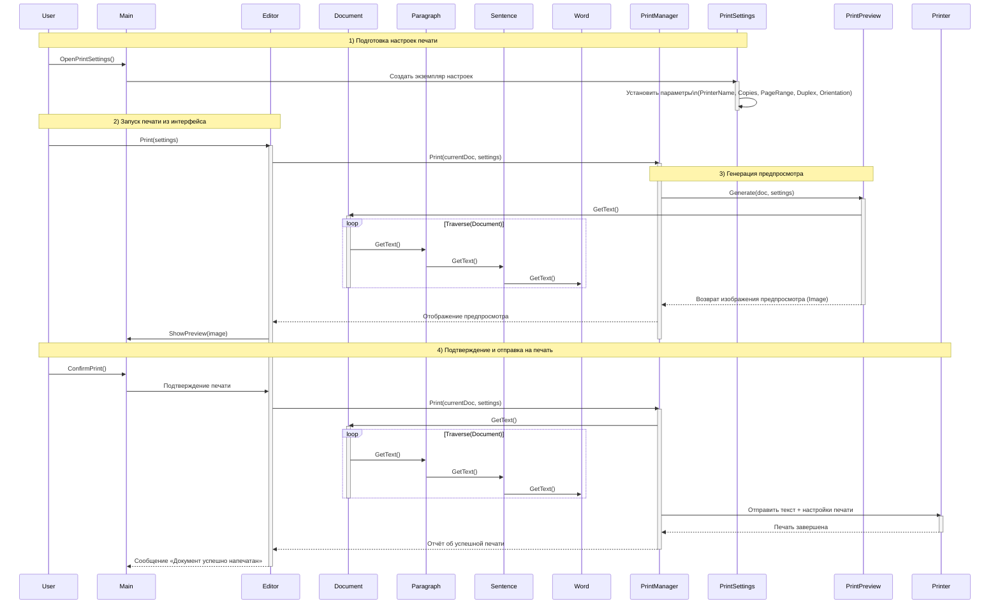

# Прецендент 3: Печать

```mermaid
sequenceDiagram
    participant User
    participant Main
    participant Editor
    participant Document
    participant Paragraph
    participant Sentence
    participant Word
    participant PrintManager
    participant PrintSettings
    participant PrintPreview
    participant Printer

    %% ==============================
    Note over User, PrintSettings: 1) Подготовка настроек печати
    %% ==============================
    User->>Main: OpenPrintSettings()
    Main->>PrintSettings: Создать экземпляр настроек
    activate PrintSettings
    PrintSettings->>PrintSettings: Установить параметры\n(PrinterName, Copies, PageRange, Duplex, Orientation)
    deactivate PrintSettings

    %% ==============================
    Note over User, Editor: 2) Запуск печати из интерфейса
    %% ==============================
    User->>Editor: Print(settings)
    activate Editor
    Editor->>PrintManager: Print(currentDoc, settings)
    activate PrintManager

    %% ==============================
    Note over PrintManager, PrintPreview: 3) Генерация предпросмотра
    %% ==============================
    PrintManager->>PrintPreview: Generate(doc, settings)
    activate PrintPreview

    PrintPreview->>Document: GetText()
    activate Document
    loop Traverse(Document)
        Document->>Paragraph: GetText()
        Paragraph->>Sentence: GetText()
        Sentence->>Word: GetText()
    end
    deactivate Document

    PrintPreview-->>PrintManager: Возврат изображения предпросмотра (Image)
    deactivate PrintPreview

    PrintManager-->>Editor: Отображение предпросмотра
    Editor->>Main: ShowPreview(image)
    deactivate PrintManager

    %% ==============================
    Note over User, Printer: 4) Подтверждение и отправка на печать
    %% ==============================
    User->>Main: ConfirmPrint()
    Main->>Editor: Подтверждение печати
    Editor->>PrintManager: Print(currentDoc, settings)
    activate PrintManager

    PrintManager->>Document: GetText()
    activate Document
    loop Traverse(Document)
        Document->>Paragraph: GetText()
        Paragraph->>Sentence: GetText()
        Sentence->>Word: GetText()
    end
    deactivate Document

    PrintManager->>Printer: Отправить текст + настройки печати
    activate Printer
    Printer-->>PrintManager: Печать завершена
    deactivate Printer

    PrintManager-->>Editor: Отчёт об успешной печати
    deactivate PrintManager
    Editor-->>Main: Сообщение «Документ успешно напечатан»
    deactivate Editor


```

