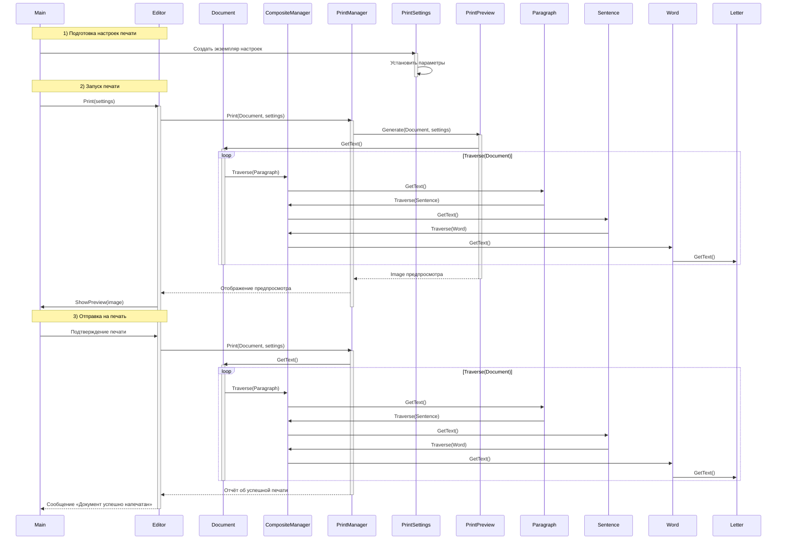

# Прецендент 3: Печать

```mermaid
sequenceDiagram
    participant Main
    participant Editor
    participant Document
    participant CompositeManager
    participant PrintManager
    participant PrintSettings
    participant PrintPreview
    participant Paragraph
    participant Sentence
    participant Word
    participant Letter

    Note over Main, Editor: 1) Подготовка настроек печати

    Main->>PrintSettings: Создать экземпляр настроек
    activate PrintSettings
    PrintSettings->>PrintSettings: Установить параметры
    deactivate PrintSettings

    Note over Main, Editor: 2) Запуск печати

    Main->>Editor: Print(settings)
    activate Editor
    Editor->>PrintManager: Print(Document, settings)
    activate PrintManager

    PrintManager->>PrintPreview: Generate(Document, settings)
    activate PrintPreview

    PrintPreview->>Document: GetText()
    activate Document
    loop Traverse(Document)
        Document->>CompositeManager: Traverse(Paragraph)
        CompositeManager->>Paragraph: GetText()
        Paragraph->>CompositeManager: Traverse(Sentence)
        CompositeManager->>Sentence: GetText()
        Sentence->>CompositeManager: Traverse(Word)
        CompositeManager->>Word: GetText()
        Word->>Letter: GetText()
    end
    deactivate Document

    PrintPreview-->>PrintManager: Image предпросмотра
    deactivate PrintPreview
    PrintManager-->>Editor: Отображение предпросмотра
    Editor->>Main: ShowPreview(image)
    deactivate PrintManager

    Note over Main, Editor: 3) Отправка на печать

    Main->>Editor: Подтверждение печати
    Editor->>PrintManager: Print(Document, settings)
    activate PrintManager

    PrintManager->>Document: GetText()
    activate Document
    loop Traverse(Document)
        Document->>CompositeManager: Traverse(Paragraph)
        CompositeManager->>Paragraph: GetText()
        Paragraph->>CompositeManager: Traverse(Sentence)
        CompositeManager->>Sentence: GetText()
        Sentence->>CompositeManager: Traverse(Word)
        CompositeManager->>Word: GetText()
        Word->>Letter: GetText()
    end
    deactivate Document

    PrintManager-->>Editor: Отчёт об успешной печати
    deactivate PrintManager
    Editor-->>Main: Сообщение «Документ успешно напечатан»
    deactivate Editor


```

