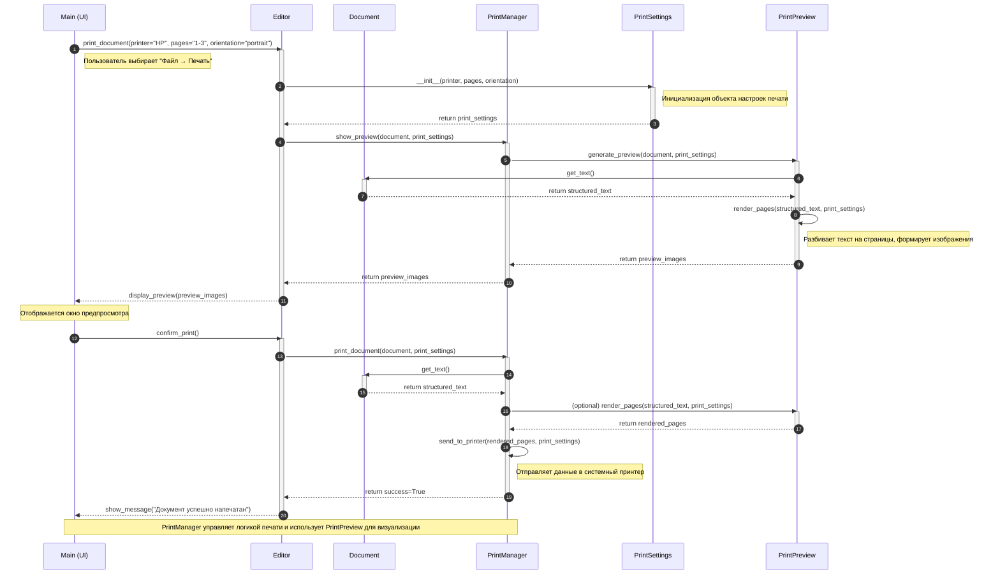

# Прецендент 3: Печать

```mermaid
sequenceDiagram
    autonumber
    participant Main as Main (UI)
    participant Editor as Editor
    participant Document as Document
    participant PrintManager as PrintManager
    participant PrintSettings as PrintSettings
    participant PrintPreview as PrintPreview

    %% === НАЖАТИЕ НА "ПЕЧАТЬ" ===
    Main->>Editor: print_document(printer="HP", pages="1-3", orientation="portrait")
    activate Editor
    Note right of Main: Пользователь выбирает "Файл → Печать"

    %% === СОЗДАНИЕ НАСТРОЕК ПЕЧАТИ ===
    Editor->>PrintSettings: __init__(printer, pages, orientation)
    activate PrintSettings
    Note right of PrintSettings: Инициализация объекта настроек печати
    PrintSettings-->>Editor: return print_settings
    deactivate PrintSettings

    %% === ПРЕДПРОСМОТР ПЕЧАТИ ===
    Editor->>PrintManager: show_preview(document, print_settings)
    activate PrintManager
    PrintManager->>PrintPreview: generate_preview(document, print_settings)
    activate PrintPreview
    PrintPreview->>Document: get_text()
    activate Document
    Document-->>PrintPreview: return structured_text
    deactivate Document
    PrintPreview->>PrintPreview: render_pages(structured_text, print_settings)
    Note right of PrintPreview: Разбивает текст на страницы, формирует изображения
    PrintPreview-->>PrintManager: return preview_images
    deactivate PrintPreview
    PrintManager-->>Editor: return preview_images
    deactivate PrintManager
    Editor-->>Main: display_preview(preview_images)
    deactivate Editor
    Note over Main: Отображается окно предпросмотра

    %% === ПОДТВЕРЖДЕНИЕ ПЕЧАТИ ===
    Main->>Editor: confirm_print()
    activate Editor
    Editor->>PrintManager: print_document(document, print_settings)
    activate PrintManager
    PrintManager->>Document: get_text()
    activate Document
    Document-->>PrintManager: return structured_text
    deactivate Document
    PrintManager->>PrintPreview: (optional) render_pages(structured_text, print_settings)
    activate PrintPreview
    PrintPreview-->>PrintManager: return rendered_pages
    deactivate PrintPreview

    %% === ПЕЧАТЬ ===
    PrintManager->>PrintManager: send_to_printer(rendered_pages, print_settings)
    Note right of PrintManager: Отправляет данные в системный принтер
    PrintManager-->>Editor: return success=True
    deactivate PrintManager
    Editor-->>Main: show_message("Документ успешно напечатан")
    deactivate Editor

    Note over Main,PrintManager: PrintManager управляет логикой печати и использует PrintPreview для визуализации


```

