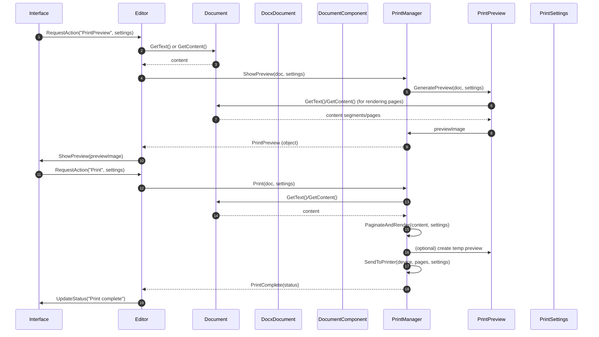

# Прецендент 3: Печать

```mermaid
sequenceDiagram
    autonumber
    participant UI as Interface
    participant ED as Editor
    participant DOC as Document
    participant BASE as DocxDocument
    participant ROOT as DocumentComponent
    participant PM as PrintManager
    participant PREV as PrintPreview
    participant PS as PrintSettings

    UI->>ED: RequestAction("PrintPreview", settings)
    ED->>DOC: GetText() or GetContent()
    DOC-->>ED: content
    ED->>PM: ShowPreview(doc, settings)
    PM->>PREV: GeneratePreview(doc, settings)
    PREV->>DOC: GetText()/GetContent() (for rendering pages)
    DOC-->>PREV: content segments/pages
    PREV->>PM: previewImage
    PM-->>ED: PrintPreview (object)
    ED->>UI: ShowPreview(previewImage)

    UI->>ED: RequestAction("Print", settings)
    ED->>PM: Print(doc, settings)
    PM->>DOC: GetText()/GetContent()
    DOC-->>PM: content
    PM->>PM: PaginateAndRender(content, settings)
    PM->>PREV: (optional) create temp preview
    PM->>PM: SendToPrinter(device, pages, settings)
    PM-->>ED: PrintComplete(status)
    ED->>UI: UpdateStatus("Print complete")


```

