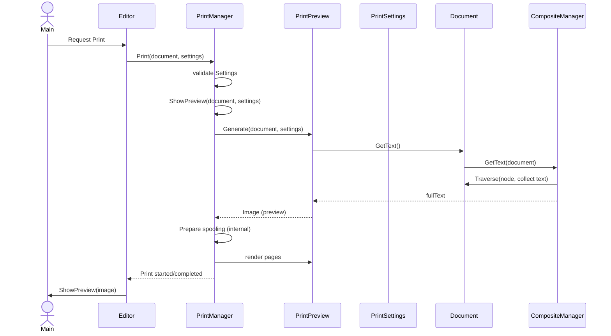

# Прецендент 3: Печать

```mermaid
sequenceDiagram
    actor Main
    participant Editor
    participant PrintManager
    participant PrintPreview
    participant PrintSettings
    participant Document
    participant CompositeManager

    Main->>Editor: Request Print
    Editor->>PrintManager: Print(document, settings)

    PrintManager->>PrintManager: validate Settings
    PrintManager->>PrintManager: ShowPreview(document, settings)

    PrintManager->>PrintPreview: Generate(document, settings)
    PrintPreview->>Document: GetText()
    Document->>CompositeManager: GetText(document)
    CompositeManager->>Document: Traverse(node, collect text)
    CompositeManager-->>PrintPreview: fullText

    PrintPreview-->>PrintManager: Image (preview)
    PrintManager->>PrintManager: Prepare spooling (internal)
    PrintManager->>PrintPreview: render pages
    PrintManager-->>Editor: Print started/completed

    Editor->>Main: ShowPreview(image)


```

