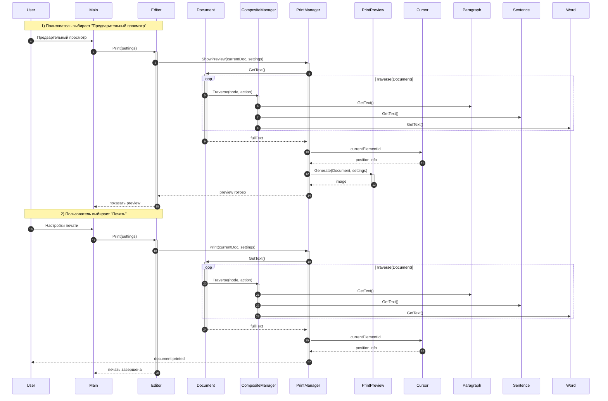

# Прецендент 3: Печать

```mermaid
sequenceDiagram
    autonumber

    participant User
    participant Main
    participant Editor
    participant Document
    participant CompositeManager
    participant PrintManager
    participant PrintPreview
    participant Cursor

    %% ==========================================
    %% 1) Предварительный просмотр печати
    %% ==========================================

    Note over User,Editor: 1) Пользователь выбирает "Предварительный просмотр"

    User->>Main: Предвартельный просмотр
    Main->>Editor: Print(settings)
    activate Editor

    Editor->>PrintManager: ShowPreview(currentDoc, settings)
    activate PrintManager

    %% Получение текста документа через CompositeManager
    PrintManager->>Document: GetText()
    activate Document

    loop Traverse(Document)
        Document->>CompositeManager: Traverse(node, action)
        activate CompositeManager
        CompositeManager->>Paragraph: GetText()
        CompositeManager->>Sentence: GetText()
        CompositeManager->>Word: GetText()
        deactivate CompositeManager
    end
    Document-->>PrintManager: fullText
    deactivate Document

    %% Отметка позиции курсора
    PrintManager->>Cursor: currentElementId
    Cursor-->>PrintManager: position info

    %% Генерация превью
    PrintManager->>PrintPreview: Generate(Document, settings)
    activate PrintPreview
    PrintPreview-->>PrintManager: image
    deactivate PrintPreview

    PrintManager-->>Editor: preview готово
    deactivate PrintManager

    Editor-->>Main: показать preview
    deactivate Editor


    %% ==========================================
    %% 2) Печать документа
    %% ==========================================

    Note over User,Editor: 2) Пользователь выбирает "Печать"

    User->>Main: Настройки печати
    Main->>Editor: Print(settings)
    activate Editor

    Editor->>PrintManager: Print(currentDoc, settings)
    activate PrintManager

    %% Получение текста документа через CompositeManager
    PrintManager->>Document: GetText()
    activate Document

    loop Traverse(Document)
        Document->>CompositeManager: Traverse(node, action)
        activate CompositeManager
        CompositeManager->>Paragraph: GetText()
        CompositeManager->>Sentence: GetText()
        CompositeManager->>Word: GetText()
        deactivate CompositeManager
    end
    Document-->>PrintManager: fullText
    deactivate Document

    %% Отметка позиции курсора
    PrintManager->>Cursor: currentElementId
    Cursor-->>PrintManager: position info

    %% Печать документа на принтер
    PrintManager-->>User: document printed
    deactivate PrintManager

    Editor-->>Main: печать завершена
    deactivate Editor


```

