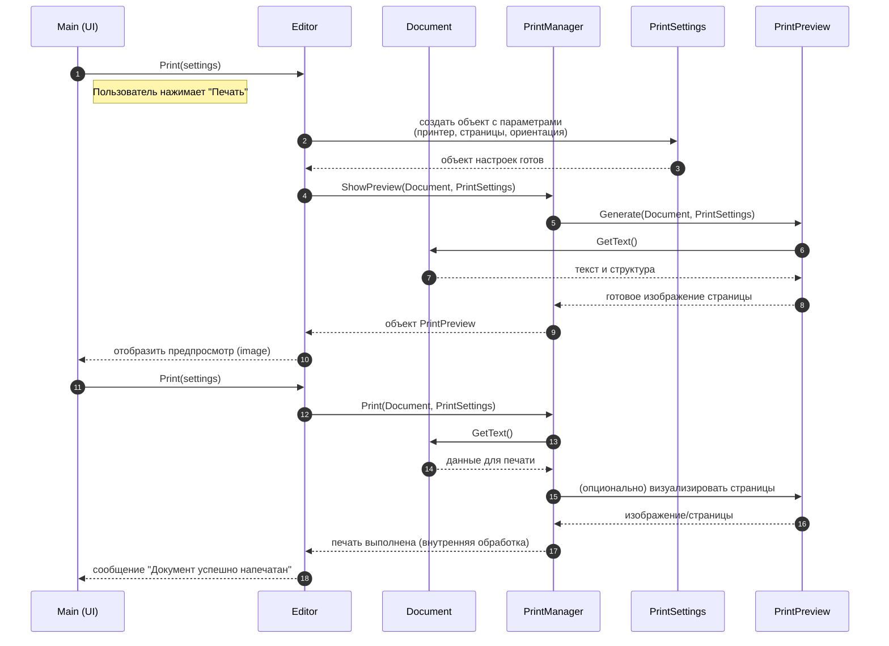

# Прецендент 3: Печать

```mermaid
sequenceDiagram
    autonumber
    participant Main as Main (UI)
    participant Editor as Editor
    participant Document as Document
    participant PrintManager as PrintManager
    participant PrintSettings as PrintSettings
    participant PrintPreview as PrintPreview

   
    Main->>Editor: Print(settings)
    Note right of Main: Пользователь нажимает "Печать"

    Editor->>PrintSettings: создать объект с параметрами<br/>(принтер, страницы, ориентация)
    PrintSettings-->>Editor: объект настроек готов

   
    Editor->>PrintManager: ShowPreview(Document, PrintSettings)
    PrintManager->>PrintPreview: Generate(Document, PrintSettings)
    PrintPreview->>Document: GetText()
    Document-->>PrintPreview: текст и структура
    PrintPreview-->>PrintManager: готовое изображение страницы
    PrintManager-->>Editor: объект PrintPreview
    Editor-->>Main: отобразить предпросмотр (image)

   
    Main->>Editor: Print(settings)
    Editor->>PrintManager: Print(Document, PrintSettings)
    PrintManager->>Document: GetText()
    Document-->>PrintManager: данные для печати
    PrintManager->>PrintPreview: (опционально) визуализировать страницы
    PrintPreview-->>PrintManager: изображение/страницы
    PrintManager-->>Editor: печать выполнена (внутренняя обработка)
    Editor-->>Main: сообщение "Документ успешно напечатан"


```

