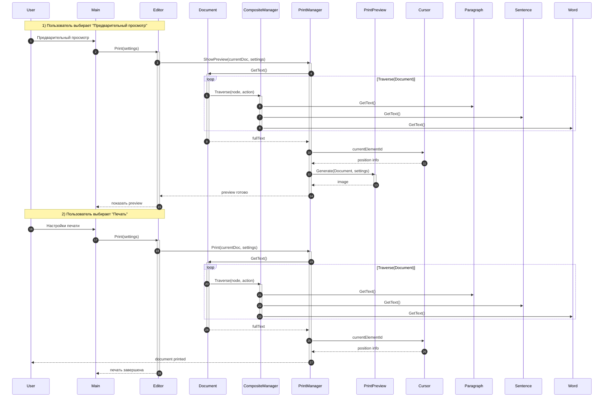

# Прецедент 3: Печать документа с предварительным просмотром

## Основная информация

**Рамки:** Приложение «Текстовый редактор» с системой предварительного просмотра печати  
**Уровень:** Задача, определённая пользователем  
**Основной исполнитель:** Пользователь  

## Заинтересованные лица и их требования

| Лицо | Требования |
|------|------------|
| Пользователь | Хочет видеть как документ будет выглядеть на бумаге перед печатью, избегая ошибок форматирования |
| Разработчики | Требуют единой системы обработки документа для просмотра и печати |
| Офисные работники | Нуждаются в точном отображении структуры документа при печати |

## Предусловия

- Документ открыт и содержит текст
- Система печати доступна (драйверы установлены)
- Пользователь имеет права на использование принтера

## Постусловия (результаты)

- Документ распечатан с учетом всех настроек
- Пользователь получил предварительный просмотр
- Позиция курсора учтена для навигации в preview

## Основной успешный сценарий

1. Пользователь запрашивает предварительный просмотр печати
2. Система собирает текст документа через композитную структуру
3. CompositeManager рекурсивно обходит все элементы документа
4. PrintManager генерирует изображение предварительного просмотра
5. Пользователь просматривает preview и настраивает параметры
6. Пользователь подтверждает печать
7. Система отправляет документ на принтер
8. Система уведомляет о успешной печати

## Расширения (альтернативные потоки)

### 4а. Проблемы с генерацией preview
- Система использует упрощенный режим просмотра
- Сообщает пользователю об ограничениях

### 7а. Принтер недоступен
- Система предлагает сохранить документ в PDF для последующей печати
- Предлагает выбрать альтернативный принтер

### 7б. Ошибка форматирования при печати
- Система автоматически корректирует настройки
- Перегенерирует preview с исправлениями

## Специальные требования

- Точное отображение композитной структуры в preview
- Учет позиции курсора для выделения текущего элемента
- Поддержка различных настроек печати (поля, ориентация, масштаб)
- Быстрая генерация preview для больших документов

## Частота использования

**Средняя:** регулярная необходимость в печати документов с контролем результата

## Технические особенности

- **Единая система обработки:** один механизм для preview и печати
- **Рекурсивный обход:** для точного воспроизведения структуры
- **Визуализация курсора:** выделение текущей позиции редактирования

## Диаграмма последовательности печати документа

## Компоненты системы печати

| Компонент | Ответственность |
|-----------|-----------------|
| **PrintManager** | Координация процесса печати и preview |
| **CompositeManager** | Рекурсивный обход структуры документа |
| **PrintPreview** | Генерация визуального представления для просмотра |
| **Cursor** | Предоставление информации о текущей позиции редактирования |

## Настройки печати

| Параметр | Описание | Значения по умолчанию |
|----------|----------|----------------------|
| **Ориентация** | Расположение страницы | Книжная (Portrait) |
| **Поля** | Отступы от краев страницы | 2.5 см со всех сторон |
| **Масштаб** | Размер отображения | 100% |
| **Диапазон страниц** | Выбор страниц для печати | Все страницы |
| **Качество** | Разрешение печати | Стандартное (300 DPI) |

## Особенности предварительного просмотра

- **Точное соответствие:** preview полностью соответствует результату печати
- **Выделение курсора:** текущая позиция редактирования отмечается в preview
- **Быстрый просмотр:** мгновенная генерация для документов любого размера
- **Интерактивная настройка:** изменение параметров с immediate preview обновлением

## Обработка ошибок печати

- **Автоматическое определение** проблем с принтером
- **Альтернативные варианты** экспорта в PDF
- **Детализированные сообщения** об ошибках для пользователя
