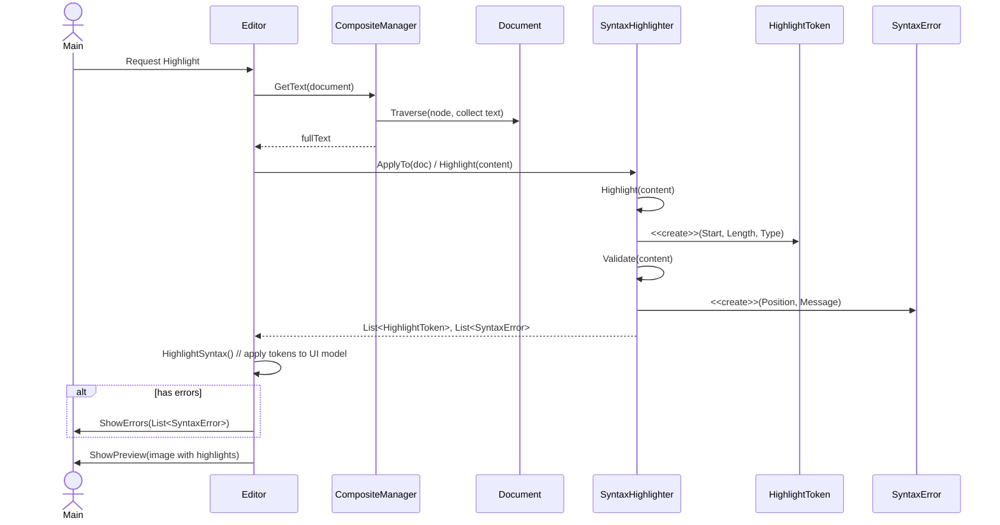

# Прецедент 4: Подсветка синтаксиса

```mermaid
sequenceDiagram
    actor Main
    participant Editor
    participant CompositeManager
    participant Document
    participant SyntaxHighlighter
    participant HighlightToken
    participant SyntaxError

    Main->>Editor: Request Highlight
    Editor->>CompositeManager: GetText(document)
    CompositeManager->>Document: Traverse(node, collect text)
    CompositeManager-->>Editor: fullText

    Editor->>SyntaxHighlighter: ApplyTo(doc) / Highlight(content)
    SyntaxHighlighter->>SyntaxHighlighter: Highlight(content)
    SyntaxHighlighter->>HighlightToken: <<create>>(Start, Length, Type)

    SyntaxHighlighter->>SyntaxHighlighter: Validate(content)
    SyntaxHighlighter->>SyntaxError: <<create>>(Position, Message)

    SyntaxHighlighter-->>Editor: List<HighlightToken>, List<SyntaxError>

    Editor->>Editor: HighlightSyntax() // apply tokens to UI model
    alt has errors
        Editor->>Main: ShowErrors(List<SyntaxError>)
    end
    Editor->>Main: ShowPreview(image with highlights)


```
