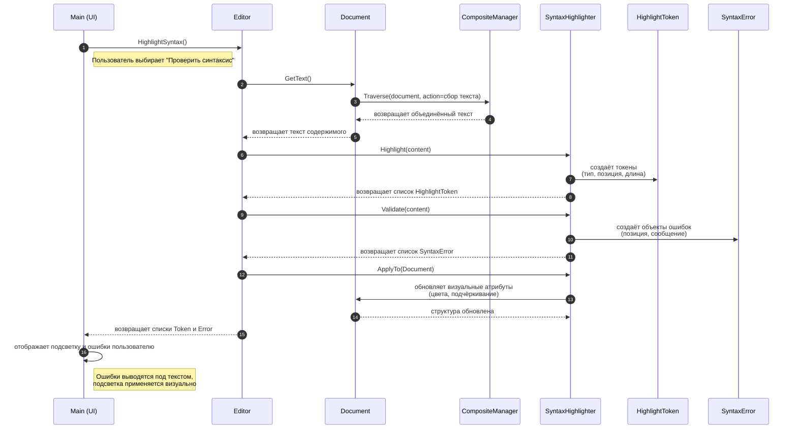

# Прецедент 4: Подсветка синтаксиса

```mermaid
sequenceDiagram
    autonumber
    participant Main as Main (UI)
    participant Editor as Editor
    participant Document as Document
    participant CompositeManager as CompositeManager
    participant SyntaxHighlighter as SyntaxHighlighter
    participant HighlightToken as HighlightToken
    participant SyntaxError as SyntaxError

    %% === ИНИЦИАЦИЯ ===
    Main->>Editor: HighlightSyntax()
    Note right of Main: Пользователь выбирает "Проверить синтаксис"

   
    Editor->>Document: GetText()
    Document->>CompositeManager: Traverse(document, action=сбор текста)
    CompositeManager-->>Document: возвращает объединённый текст
    Document-->>Editor: возвращает текст содержимого

    
    Editor->>SyntaxHighlighter: Highlight(content)
    SyntaxHighlighter->>HighlightToken: создаёт токены<br/>(тип, позиция, длина)
    SyntaxHighlighter-->>Editor: возвращает список HighlightToken

   
    Editor->>SyntaxHighlighter: Validate(content)
    SyntaxHighlighter->>SyntaxError: создаёт объекты ошибок<br/>(позиция, сообщение)
    SyntaxHighlighter-->>Editor: возвращает список SyntaxError

    
    Editor->>SyntaxHighlighter: ApplyTo(Document)
    SyntaxHighlighter->>Document: обновляет визуальные атрибуты<br/>(цвета, подчёркивание)
    Document-->>SyntaxHighlighter: структура обновлена

    
    Editor-->>Main: возвращает списки Token и Error
    Main->>Main: отображает подсветку и ошибки пользователю
    Note right of Main: Ошибки выводятся под текстом,<br/>подсветка применяется визуально

```
