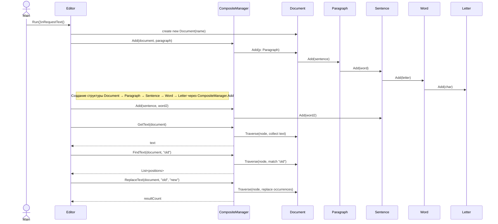

# Прецедент 4: Подсветка синтаксиса

```mermaid
sequenceDiagram
    actor Main
    participant Editor
    participant CompositeManager
    participant Document
    participant Paragraph
    participant Sentence
    participant Word
    participant Letter

    Main->>Editor: Run()\nRequestText()
    Editor->>Document: create new Document(name)

    Editor->>CompositeManager: Add(document, paragraph)
    CompositeManager->>Document: Add(p: Paragraph)
    Document->>Paragraph: Add(sentence)
    Paragraph->>Sentence: Add(word)
    Sentence->>Word: Add(letter)
    Word->>Letter: Add(char)

    Note right of Editor: Создание структуры Document → Paragraph → Sentence → Word → Letter через CompositeManager.Add

    Editor->>CompositeManager: Add(sentence, word2)
    CompositeManager->>Sentence: Add(word2)

    Editor->>CompositeManager: GetText(document)
    CompositeManager->>Document: Traverse(node, collect text)
    CompositeManager-->>Editor: text

    Editor->>CompositeManager: FindText(document, "old")
    CompositeManager->>Document: Traverse(node, match "old")
    CompositeManager-->>Editor: List<positions>

    Editor->>CompositeManager: ReplaceText(document, "old", "new")
    CompositeManager->>Document: Traverse(node, replace occurrences)
    CompositeManager-->>Editor: resultCount


```
