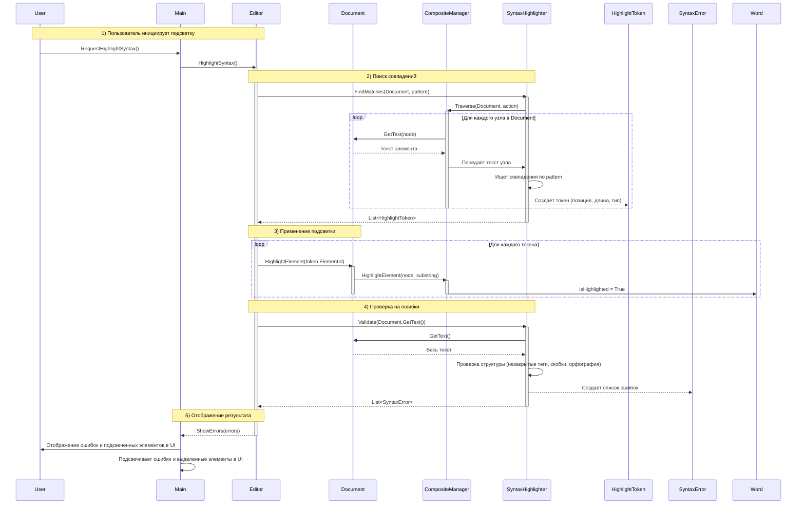

# Прецедент 4: Подсветка синтаксиса

```mermaid
sequenceDiagram
    participant User
    participant Main
    participant Editor
    participant Document
    participant CompositeManager
    participant SyntaxHighlighter
    participant HighlightToken
    participant SyntaxError
    participant Word

    %% -------------------------------
    Note over User, Editor: 1) Пользователь инициирует подсветку
    %% -------------------------------

    User->>Main: RequestHighlightSyntax()
    Main->>Editor: HighlightSyntax()
    activate Editor

    %% -------------------------------
    Note over Editor, SyntaxHighlighter: 2) Поиск совпадений
    %% -------------------------------

    Editor->>SyntaxHighlighter: FindMatches(Document, pattern)
    activate SyntaxHighlighter

    %% Traverse документа через CompositeManager
    SyntaxHighlighter->>CompositeManager: Traverse(Document, action)
    activate CompositeManager

    loop Для каждого узла в Document
        CompositeManager->>Document: GetText(node)
        Document-->>CompositeManager: Текст элемента
        CompositeManager->>SyntaxHighlighter: Передаёт текст узла
        SyntaxHighlighter->>SyntaxHighlighter: Ищет совпадения по pattern
        SyntaxHighlighter-->>HighlightToken: Создаёт токен (позиция, длина, тип)
    end
    deactivate CompositeManager

    SyntaxHighlighter-->>Editor: List<HighlightToken>
    deactivate SyntaxHighlighter

    %% -------------------------------
    Note over Editor, Document: 3) Применение подсветки
    %% -------------------------------

    loop Для каждого токена
        Editor->>Document: HighlightElement(token.ElementId)
        activate Document
        Document->>CompositeManager: HighlightElement(node, substring)
        activate CompositeManager
        CompositeManager->>Word: isHighlighted = True
        deactivate CompositeManager
        deactivate Document
    end

    %% -------------------------------
    Note over Editor, SyntaxHighlighter: 4) Проверка на ошибки
    %% -------------------------------

    Editor->>SyntaxHighlighter: Validate(Document.GetText())
    activate SyntaxHighlighter

    SyntaxHighlighter->>Document: GetText()
    Document-->>SyntaxHighlighter: Весь текст
    SyntaxHighlighter->>SyntaxHighlighter: Проверка структуры (незакрытые теги, скобки, орфография)
    SyntaxHighlighter-->>SyntaxError: Создаёт список ошибок
    SyntaxHighlighter-->>Editor: List<SyntaxError>
    deactivate SyntaxHighlighter

    %% -------------------------------
    Note over Editor, Main: 5) Отображение результата
    %% -------------------------------

    Editor-->>Main: ShowErrors(errors)
    deactivate Editor

    Main->>User: Отображение ошибок и подсвеченных элементов в UI
    Main->>Main: Подсвечивает ошибки и выделенные элементы в UI


   


```
