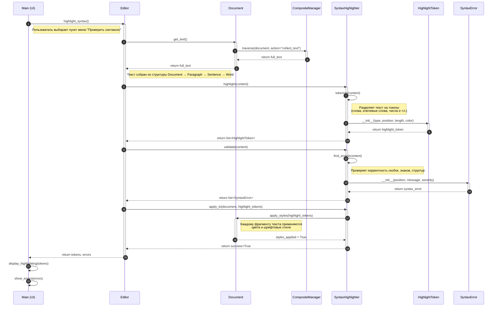

# Прецедент 4: Подсветка синтаксиса

```mermaid
sequenceDiagram
    autonumber
    participant Main as Main (UI)
    participant Editor as Editor
    participant Document as Document
    participant CompositeManager as CompositeManager
    participant SyntaxHighlighter as SyntaxHighlighter
    participant HighlightToken as HighlightToken
    participant SyntaxError as SyntaxError

    Main->>Editor: highlight_syntax()
    activate Editor
    Note right of Main: Пользователь выбирает пункт меню "Проверить синтаксис"

    Editor->>Document: get_text()
    activate Document
    Document->>CompositeManager: traverse(document, action="collect_text")
    activate CompositeManager
    CompositeManager-->>Document: return full_text
    deactivate CompositeManager
    Document-->>Editor: return full_text
    deactivate Document
    Note right of Editor: Текст собран из структуры Document → Paragraph → Sentence → Word

    Editor->>SyntaxHighlighter: highlight(content)
    activate SyntaxHighlighter
    SyntaxHighlighter->>SyntaxHighlighter: tokenize(content)
    Note right of SyntaxHighlighter: Разделяет текст на токены<br/>(слова, ключевые слова, числа и т.п.)
    SyntaxHighlighter->>HighlightToken: __init__(type, position, length, color)
    activate HighlightToken
    HighlightToken-->>SyntaxHighlighter: return highlight_token
    deactivate HighlightToken
    SyntaxHighlighter-->>Editor: return list<HighlightToken>
    deactivate SyntaxHighlighter

    Editor->>SyntaxHighlighter: validate(content)
    activate SyntaxHighlighter
    SyntaxHighlighter->>SyntaxHighlighter: find_errors(content)
    Note right of SyntaxHighlighter: Проверяет корректность скобок, знаков, структур
    SyntaxHighlighter->>SyntaxError: __init__(position, message, severity)
    activate SyntaxError
    SyntaxError-->>SyntaxHighlighter: return syntax_error
    deactivate SyntaxError
    SyntaxHighlighter-->>Editor: return list<SyntaxError>
    deactivate SyntaxHighlighter

    Editor->>SyntaxHighlighter: apply_to(document, highlight_tokens)
    activate SyntaxHighlighter
    SyntaxHighlighter->>Document: apply_styles(highlight_tokens)
    activate Document
    Note right of Document: Каждому фрагменту текста применяются<br/>цвета и шрифтовые стили
    Document-->>SyntaxHighlighter: styles_applied = True
    deactivate Document
    SyntaxHighlighter-->>Editor: return success=True
    deactivate SyntaxHighlighter

    Editor-->>Main: return tokens, errors
    deactivate Editor
    Main->>Main: display_highlighting(tokens)
    Main->>Main: show_errors(errors)
   


```
