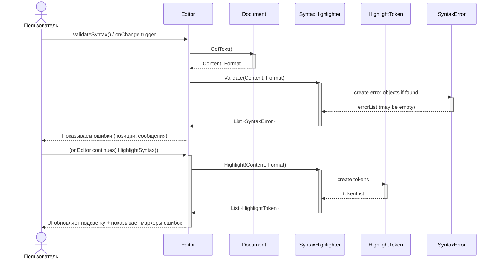

# Прецедент 4: Подсветка синтаксиса

```mermaid
sequenceDiagram
    actor User as Пользователь
    participant Editor as Editor
    participant Document as Document
    participant SyntaxHighlighter as SyntaxHighlighter
    participant HighlightToken as HighlightToken
    participant SyntaxError as SyntaxError

    %% Пользователь запрашивает валидацию либо изменение триггерит проверку
    User->>Editor: ValidateSyntax() / onChange trigger
    activate Editor
    Editor->>Document: GetText()
    activate Document
    Document-->>Editor: Content, Format
    deactivate Document

    %% Проверка ошибок
    Editor->>SyntaxHighlighter: Validate(Content, Format)
    activate SyntaxHighlighter
    SyntaxHighlighter->>SyntaxError: create error objects if found
    activate SyntaxError
    SyntaxError-->>SyntaxHighlighter: errorList (may be empty)
    deactivate SyntaxError
    SyntaxHighlighter-->>Editor: List~SyntaxError~
    deactivate SyntaxHighlighter

    Editor-->>User: Показываем ошибки (позиции, сообщения)

    %% Подсветка (токены) для отображения в редакторе
    User->>Editor: (or Editor continues) HighlightSyntax()
    activate Editor
    Editor->>SyntaxHighlighter: Highlight(Content, Format)
    activate SyntaxHighlighter
    SyntaxHighlighter->>HighlightToken: create tokens
    activate HighlightToken
    HighlightToken-->>SyntaxHighlighter: tokenList
    deactivate HighlightToken
    SyntaxHighlighter-->>Editor: List~HighlightToken~
    deactivate SyntaxHighlighter
    Editor-->>User: UI обновляет подсветку + показывает маркеры ошибок
    deactivate Editor

```
