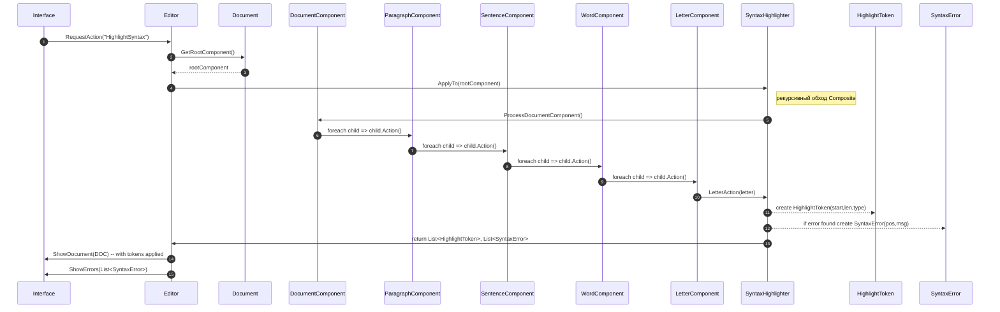

# Прецедент 4: Подсветка синтаксиса

```mermaid
sequenceDiagram
    autonumber
    participant UI as Interface
    participant ED as Editor
    participant DOC as Document
    participant ROOT as DocumentComponent
    participant PARA as ParagraphComponent
    participant SENT as SentenceComponent
    participant WORD as WordComponent
    participant LETTER as LetterComponent
    participant H as SyntaxHighlighter
    participant T as HighlightToken
    participant E as SyntaxError

    UI->>ED: RequestAction("HighlightSyntax")
    ED->>DOC: GetRootComponent()
    DOC-->>ED: rootComponent
    ED->>H: ApplyTo(rootComponent)
    note right of H: рекурсивный обход Composite
    H->>ROOT: ProcessDocumentComponent()
    ROOT->>PARA: foreach child => child.Action()
    PARA->>SENT: foreach child => child.Action()
    SENT->>WORD: foreach child => child.Action()
    WORD->>LETTER: foreach child => child.Action()
    LETTER->>H: LetterAction(letter)
    H-->>T: create HighlightToken(start,len,type)
    H-->>E: if error found create SyntaxError(pos,msg)
    H->>ED: return List<HighlightToken>, List<SyntaxError>
    ED->>UI: ShowDocument(DOC)  -- with tokens applied
    ED->>UI: ShowErrors(List<SyntaxError>)


```
