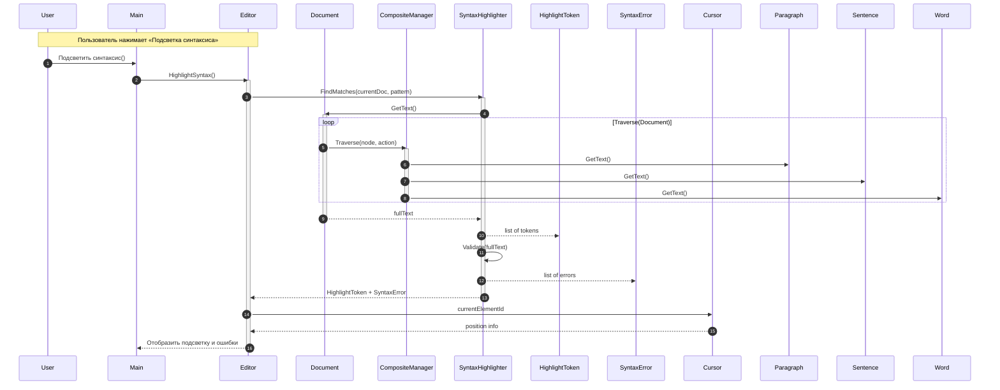

# Прецедент 4: Подсветка синтаксиса

```mermaid
sequenceDiagram
    autonumber

    participant User
    participant Main
    participant Editor
    participant Document
    participant CompositeManager
    participant SyntaxHighlighter
    participant HighlightToken
    participant SyntaxError
    participant Cursor

    %% ==========================================
    %% 1) Инициация подсветки синтаксиса
    %% ==========================================

    Note over User,Editor: Пользователь нажимает «Подсветка синтаксиса»

    User->>Main: Подсветить синтаксис()
    Main->>Editor: HighlightSyntax()
    activate Editor

    Editor->>SyntaxHighlighter: FindMatches(currentDoc, pattern)
    activate SyntaxHighlighter

    %% SyntaxHighlighter обходит документ через CompositeManager
    SyntaxHighlighter->>Document: GetText()
    activate Document

    loop Traverse(Document)
        Document->>CompositeManager: Traverse(node, action)
        activate CompositeManager
        CompositeManager->>Paragraph: GetText()
        CompositeManager->>Sentence: GetText()
        CompositeManager->>Word: GetText()
        deactivate CompositeManager
    end
    Document-->>SyntaxHighlighter: fullText
    deactivate Document

    %% Создание токенов подсветки
    SyntaxHighlighter-->>HighlightToken: list of tokens

    %% Проверка на ошибки
    SyntaxHighlighter->>SyntaxHighlighter: Validate(fullText)
    SyntaxHighlighter-->>SyntaxError: list of errors

    SyntaxHighlighter-->>Editor: HighlightToken + SyntaxError
    deactivate SyntaxHighlighter

    %% Учет позиции курсора для подсветки текущего слова
    Editor->>Cursor: currentElementId
    Cursor-->>Editor: position info

    Editor-->>Main: Отобразить подсветку и ошибки
    deactivate Editor


```
