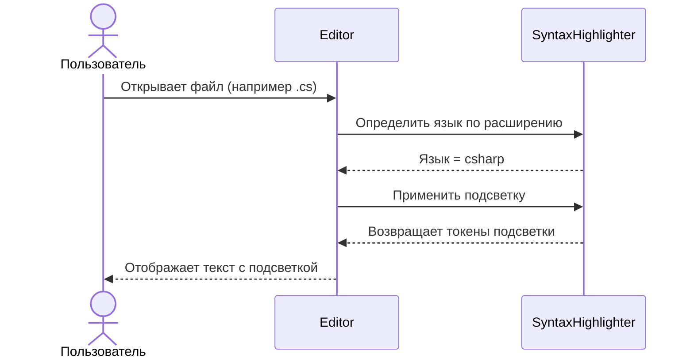

```mermaid
sequenceDiagram
    actor Пользователь
    participant Editor
    participant SyntaxHighlighter

    Пользователь->>Editor: Открывает файл (например .cs)
    Editor->>SyntaxHighlighter: Определить язык по расширению
    SyntaxHighlighter-->>Editor: Язык = csharp
    Editor->>SyntaxHighlighter: Применить подсветку
    SyntaxHighlighter-->>Editor: Возвращает токены подсветки
    Editor-->>Пользователь: Отображает текст с подсветкой
```
