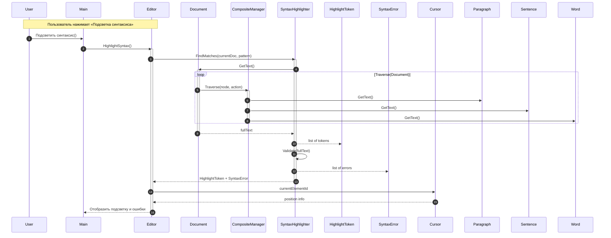

# Прецедент 4: Подсветка синтаксиса с анализом структуры

## Основная информация

**Рамки:** Приложение «Текстовый редактор» с интеллектуальной системой подсветки синтаксиса  
**Уровень:** Задача, определённая пользователем  
**Основной исполнитель:** Пользователь  

## Заинтересованные лица и их требования

| Лицо | Требования |
|------|------------|
| Пользователь | Хочет видеть цветовую подсветку синтаксиса с выделением ошибок для удобства программирования |
| Разработчики | Требуют интеграции подсветки с композитной структурой документа |
| Программисты | Нуждаются в точном определении токенов и быстром анализе кода |

## Предусловия

- Документ открыт и содержит текст
- Язык программирования определен (автоматически или вручную)
- Система подсветки синтаксиса инициализирована

## Постусловия (результаты)

- Текст отображается с цветовой подсветкой синтаксических элементов
- Обнаруженные синтаксические ошибки выделены
- Текущая позиция курсора учитывается для контекстной подсветки

## Основной успешный сценарий

1. Пользователь активирует подсветку синтаксиса
2. Система собирает текст документа через композитную структуру
3. SyntaxHighlighter анализирует текст и идентифицирует токены
4. CompositeManager рекурсивно обходит все элементы документа
5. Система создает токены подсветки для различных синтаксических элементов
6. Выполняется валидация текста на наличие синтаксических ошибок
7. Учитывается позиция курсора для контекстной подсветки
8. Документ отображается с подсветкой и выделением ошибок

## Расширения (альтернативные потоки)

### 3а. Неподдерживаемый язык программирования
- Система использует базовую подсветку для общего текста
- Предлагает пользователю выбрать язык вручную

### 6а. Обнаружены синтаксические ошибки
- Система выделяет проблемные участки цветом
- Предоставляет подсказки по исправлению ошибок

### 7а. Сложная структура кода
- Система использует расширенный анализ для вложенных конструкций
- Применяет рекурсивную подсветку для сложных выражений

## Специальные требования

- Интеграция с композитной структурой документа для точного позиционирования
- Поддержка контекстной подсветки на основе позиции курсора
- Валидация синтаксиса в реальном времени
- Кэширование результатов анализа для производительности

## Частота использования

**Очень высокая:** постоянная работа при редактировании кода, мгновенное обновление при изменениях

## Технические особенности

- **Лексический анализ:** разбиение текста на токены
- **Синтаксическая валидация:** проверка корректности конструкций
- **Контекстная подсветка:** учет позиции редактирования
- **Инкрементальное обновление:** пересчет только измененных участков

## Диаграмма последовательности подсветки синтаксиса

## Компоненты системы подсветки синтаксиса

| Компонент | Ответственность |
|-----------|-----------------|
| **SyntaxHighlighter** | Лексический анализ и идентификация токенов |
| **CompositeManager** | Рекурсивный обход структуры документа для сбора текста |
| **HighlightToken** | Хранение информации о подсвечиваемых элементах |
| **SyntaxError** | Обнаружение и хранение синтаксических ошибок |
| **Cursor** | Предоставление контекстной информации для подсветки |

## Типы токенов подсветки

| Тип токена | Цвет | Примеры |
|------------|------|---------|
| **Ключевые слова** | Синий | `class`, `function`, `if`, `return` |
| **Строки** | Зеленый | `"Hello World"`, `'text'` |
| **Комментарии** | Серый | `// comment`, `/* multiline */` |
| **Числа** | Оранжевый | `123`, `3.14`, `0xFF` |
| **Операторы** | Красный | `+`, `-`, `=`, `==` |
| **Идентификаторы** | Черный | `variableName`, `ClassName` |

## Поддерживаемые языки программирования

| Язык | Расширения | Особенности подсветки |
|------|------------|----------------------|
| **C#** | `.cs` | Ключевые слова, атрибуты, директивы, LINQ |
| **HTML** | `.html`, `.htm` | Теги, атрибуты, entities, комментарии |
| **Markdown** | `.md`, `.markdown` | Заголовки, списки, код, ссылки, таблицы |
| **CSS** | `.css` | Селекторы, свойства, значения, медиа-запросы |
| **JavaScript** | `.js` | Функции, переменные, объекты, ES6+ features |
| **Python** | `.py` | Отступы, декораторы, строки документации |

## Особенности работы в реальном времени

- **Инкрементальный анализ:** пересчет только измененных участков текста
- **Контекстное определение:** автоматическое распознавание языка по содержимому
- **Подсказки по ошибкам:** детализированные сообщения о синтаксических проблемах
- **Производительность:** кэширование результатов для больших документов
